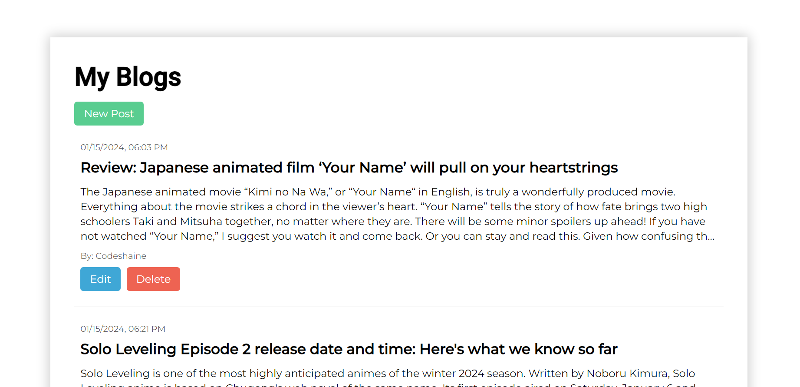
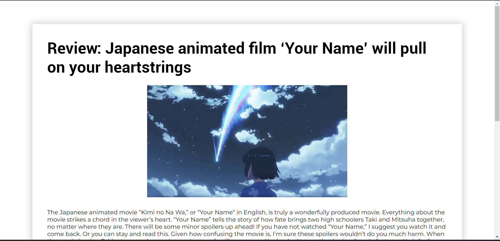

# Blog_app

### Description :

 <p>This is a web app which lets you create a simple and fixed-template blogs which contains heading,image and two paragraph sections. This application is built just for learning purpose and feel free to use the code for learning purpose.</p>
 <br>

### To run locally follow the instructions :

 <li>Clone this repository using this command</li>

```
git clone https://github.com/codeshaine/blog_app.git
```

 <li>Download and Install <a href="https://nodejs.org/en/download">Node JS</a> </li>

 <li>Download and Install <a href="https://www.mongodb.com/try/download/community">MongoDB Community Version</a></li>

  <li>Open the project folder in a Code Editor/IDE Then run the following command to install Dependencies</li>

```
npm i
```

  <li>Then you can run application using the following command</li>

```
npm run start
```

<br>

### The technologies used :

<li>Node Js</li>
<li>Express</li>
<li>EJS</li>
<li>Mongo db</li>
<br>

### Visuals :

<div align="center">


<p>Thankyou for reading <3</p>
</div>
